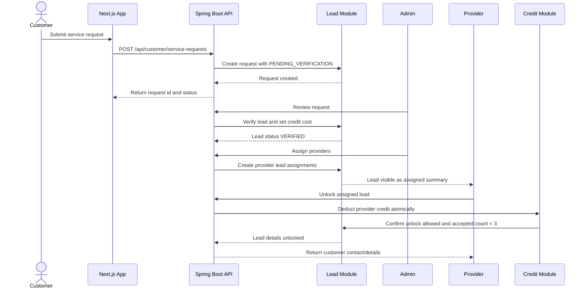

# Domain Flow — Service Connect App

## Main Lead Assignment Flow



## Lead Status Lifecycle

```text
DRAFT / SUBMITTED
  -> PENDING_VERIFICATION
  -> VERIFIED
  -> ASSIGNED
  -> PARTIALLY_ACCEPTED
  -> FULLY_ACCEPTED
  -> COMPLETED
  -> CANCELLED / REJECTED
```

## Assignment Status Lifecycle

```text
ASSIGNED
  -> VIEWED
  -> UNLOCKED
  -> CONTACTED
  -> WON / LOST / EXPIRED
```

## Provider Credit Flow

```text
TRIAL_CREDIT_GRANTED
  -> CREDIT_AVAILABLE
  -> CREDIT_RESERVED_OR_DEDUCTED_ON_UNLOCK
  -> CREDIT_LOW
  -> CONTACT_ADMIN_FOR_TOPUP
```

## Critical Invariants

1. A provider can only unlock assigned leads.
2. A provider can unlock the same lead once only.
3. Credit deduction and lead unlock must be in one transaction.
4. The number of unlocked providers per lead must never exceed 3.
5. Customer contact information must stay hidden until successful unlock.
6. Admin is the only actor allowed to verify leads and assign providers in early versions.

## Concurrency Risk

The highest-risk operation is provider lead unlock.

Required protection:

- Use database transaction.
- Lock lead row or use conditional update.
- Check provider assignment exists.
- Check provider has enough credit.
- Check provider has not unlocked the lead before.
- Check accepted provider count is below 3.
- Deduct credit.
- Create credit transaction ledger.
- Mark assignment as unlocked.

Recommended MySQL strategy for MVP:

- Use `@Transactional` at use-case/service level.
- Use `SELECT ... FOR UPDATE` on lead and provider credit wallet rows.
- Add unique constraint on `(lead_id, provider_id)` for assignment.
- Add unique constraint on credit transaction idempotency key if unlock API can retry.
